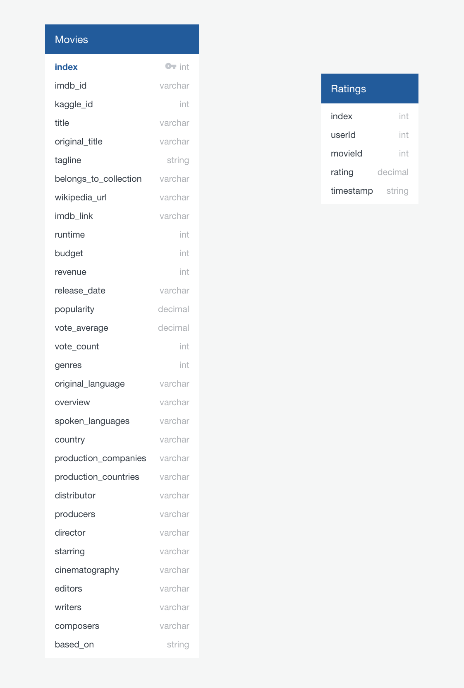

# Movies Recommendation Platform

## Overview

Amazon Prime Video is seeking to predict the popularity of lower budget movies for them to acquire for their streaming platform. The data was gathered from Wikipedia and Movielens, and we have built a pipeline to a database to keep the catalog of movies update to date. The original assignment only called for the processing, cleaning, and combining of raw data from the sources. 

As of May, I have since decided to expand on the project to build a machine learning model that will help recommend films to subscribers. I am currently in the phase of determining our initial factors that the machine learning model will utilize, and testing out various machine learning models to determine which test suit our needs.

## Database

## Data Exploration

The preliminary factors are genre, budget, revenue, runtime, director, writer, and rating.

## Machine Learning Process

The first model that I will be testing is a random forest model.

